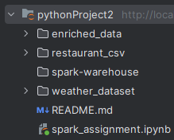
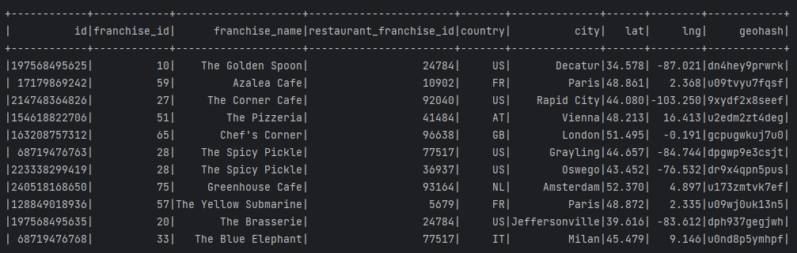

# Spark ETL Task

## Overview
This is a Spark ETL project that reads restaurant data from a local storage, checks for null values in the latitude and 
longitude columns, maps the missing values using the OpenCage Geocoding API, generates a four-character geohash, and 
left-joins the restaurant data with weather data using the geohash as the key. The enriched data is stored in the local 
file system in the Parquet format, preserving data partitioning.

## Installation
To run this project, you'll need to install Apache Spark on your local machine. I chose to install it using Docker, which made the process straightforward. Here are the steps I followed:

1. Install Docker Desktop on your machine (if it's not already installed)
2. Pull the Apache Spark image using the following command in your termina
> docker pull apache/spark:3.0.1
3. Start the Spark container using the following command:
> docker run -it -p 4040:4040 -v /path/to/your/local/code:/app apache/spark:3.0.1

Replace /path/to/your/local/code with the path to the directory where you'll store your Spark ETL job code.
4. Verify that Spark UI is running by visiting http://localhost:4040 in your browser.
5. You'll also need to obtain an API key for the OpenCage Geocoding API and update the relevant code with your API key.
---

## Features
This Spark ETL job performs the following tasks:
- Reads restaurant data from a local storage
- Maps null values in latitude and longitude using the OpenCage Geocoding API
- Generates a four-character geohash based on latitude and longitude using the geohash-java library
- Left-joins weather and restaurant data using the geohash
- Stores the enriched data in the local file system, preserving data partitioning in the parquet format.

## Examples

Dircetory structure:

Sample output of restaurant data after using geohash function:
